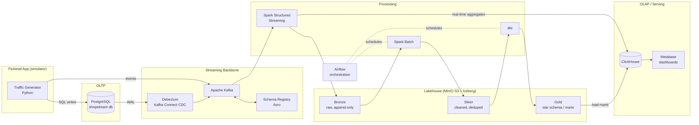

# ShopStream — A Learning Data Engineering Platform

**Status:** Draft for review
**Goal:** Build an end-to-end data platform around a fictional app, using the tools real data engineering teams use today, running (almost) entirely on Docker/Kubernetes so it costs ~$0.

---

## 1. The Fictional App: "ShopStream"

ShopStream is a fictional e-commerce store. It's a great learning domain because it naturally produces **both** kinds of data every real company has:

1. **Transactional (OLTP) data** — customers, products, orders, payments — written to a relational database by "the app".
2. **Behavioral event (clickstream) data** — page views, searches, add-to-carts — fired as events, high volume, append-only.

We won't build a real app with a UI. Instead we build a **traffic simulator** (a Python service) that behaves like the app's backend:

- It writes realistic transactions to PostgreSQL (new customers, orders being placed, paid, shipped, cancelled — including *updates*, which matter for CDC learning).
- It emits clickstream events to Kafka (sessions of users browsing, searching, converting or abandoning — with realistic funnels, bursts, late events, and a configurable % of malformed events so we have real data-quality problems to solve).

The simulator has tunable knobs: events/sec, orders/min, % anonymous users, seasonality curve, error rate. This lets us create scenarios ("Black Friday spike", "bot attack", "schema change upstream") on demand — each one is a lesson.

---

## 2. Target Architecture (end state)



Two classic paths through one system:

- **Speed layer (streaming):** app → Kafka → Spark Structured Streaming → live aggregates in ClickHouse ("revenue right now", "active sessions") + raw landing in the lake.
- **Batch layer:** lake bronze → silver → gold (dbt star schema) on an Airflow schedule → marts served from ClickHouse to Metabase.

This is effectively a **Lambda architecture on a lakehouse** — the dominant pattern in industry today, and you'll learn *why* people are trying to move to Kappa/streaming-only by feeling Lambda's pain (dual code paths) yourself.

---

## 3. Tool Choices & Rationale

| Layer | Tool | Why this one | Common alternatives you'd see at work |
|---|---|---|---|
| OLTP | **PostgreSQL 16** | The default OLTP DB everywhere; best CDC support via logical replication | MySQL, Aurora |
| Message bus | **Apache Kafka** (KRaft, single broker) | *The* industry standard; KRaft mode = no ZooKeeper to manage | Redpanda, Kinesis, Pub/Sub |
| Schemas on the wire | **Confluent Schema Registry + Avro** | Teaches schema evolution & contracts — a top interview topic | Protobuf, JSON Schema |
| CDC | **Debezium (Kafka Connect)** | The standard OSS CDC; teaches WAL/logical replication, exactly what Fivetran does under the hood | Fivetran, Airbyte |
| Stream processing | **Spark Structured Streaming** | One engine for batch *and* streaming = less to learn/run; huge job market | Flink (stretch goal — see §9), ksqlDB |
| Data lake storage | **MinIO** | S3-compatible API locally; every S3 skill transfers 1:1 | S3, GCS, ADLS |
| Table format | **Apache Iceberg** | The winning open table format (Snowflake/Databricks/AWS all adopted it); teaches ACID-on-a-lake, time travel, schema evolution | Delta Lake, Hudi |
| Batch transform | **dbt (dbt-core)** | The standard for in-warehouse SQL transformation, testing & docs | SQLMesh |
| Warehouse / OLAP | **ClickHouse** | Real columnar OLAP you can run in one container; blazing fast; widely used | Snowflake, BigQuery, Redshift, DuckDB |
| Orchestration | **Apache Airflow 3** | Still the industry default; DAGs, sensors, backfills | Dagster, Prefect |
| BI | **Metabase** | Friendliest OSS BI; dashboards in minutes | Superset, Looker, Tableau |
| Data quality | **dbt tests → Great Expectations** | Start simple (dbt), graduate to GX checkpoints in Airflow | Soda |
| Kafka visibility | **Kafka UI (provectus)** | See topics/consumers/lag in a browser — invaluable while learning | Conduktor, AKHQ |
| Monitoring (later) | **Prometheus + Grafana** | Standard observability stack | Datadog |
| Runtime | **Docker Compose → k3d (K8s)** | Compose to learn the tools, K8s (phase 6) to learn to *operate* them | EKS/GKE |

**Cost: $0.** Everything is OSS and local. The only "cost" is RAM — see §8.

---

## 4. Data Design

### 4.1 OLTP schema (PostgreSQL, normalized 3NF)

The app's operational database — modeled like a backend engineer would, *not* for analytics (that friction is the point):

```
customers   (customer_id PK, email, full_name, country_code, marketing_opt_in, created_at, updated_at)
products    (product_id PK, sku, name, category, subcategory, unit_price, is_active, created_at, updated_at)
inventory   (product_id PK/FK, quantity_on_hand, updated_at)
orders      (order_id PK, customer_id FK, status [pending→paid→shipped→delivered | cancelled],
             currency, total_amount, created_at, updated_at)
order_items (order_item_id PK, order_id FK, product_id FK, quantity, unit_price_at_purchase)
payments    (payment_id PK, order_id FK, method [card|paypal|giftcard], status, amount, created_at)
```

Deliberate learning traps built in:
- `orders.status` **mutates** → you need CDC or snapshots, a naive daily `SELECT *` misses intermediate states.
- `products.unit_price` changes over time → you need **SCD Type 2** in the warehouse to report historical revenue correctly.
- Deletes happen (GDPR customer erasure scenario) → tombstone handling.

### 4.2 Event schema (Avro, on Kafka)

One envelope, typed payloads per event type. Topic: `shopstream.events.v1` (keyed by `session_id` for ordering per session).

```jsonc
{
  "event_id":   "uuid",            // idempotency / dedup key
  "event_type": "page_view | product_view | search | add_to_cart | remove_from_cart | begin_checkout | purchase",
  "event_ts":   "timestamp-millis",// event time (may arrive late!)
  "session_id": "uuid",
  "customer_id":"long | null",     // null = anonymous browsing
  "device":     { "type": "mobile|desktop|tablet", "os": "...", "browser": "..." },
  "page_url":   "string",
  "referrer":   "string | null",
  "properties": { "map<string,string>" }   // e.g. product_id, search_query, cart_value
}
```

CDC topics (from Debezium): `cdc.shopstream.public.orders`, `...customers`, etc., plus a dead-letter topic `shopstream.events.dlq` for poison messages.

### 4.3 Lakehouse layout (MinIO + Iceberg — medallion architecture)

```
s3://lake/
├── bronze/    # exactly what arrived, append-only, partitioned by ingest date
│   ├── events/            (from Kafka, streaming write)
│   └── cdc_orders/, cdc_customers/, ...   (from CDC topics)
├── silver/    # deduped (by event_id / primary key), typed, flattened, PII masked
│   ├── events/            partitioned by event_date
│   └── orders/, customers/, products/     (latest-state + change history)
└── gold/      # business-ready (built by dbt, also loaded to ClickHouse)
```

### 4.4 OLAP schema (Kimball star schema, gold layer)

```
dim_date        (date_key, ...)
dim_customer    (customer_key, customer_id, ..., valid_from, valid_to, is_current)   -- SCD2
dim_product     (product_key, product_id, ..., unit_price, valid_from, valid_to, is_current)  -- SCD2
fct_orders      (grain: one row per order item; FKs to dims; qty, revenue, discount)
fct_events      (grain: one row per event; conformed dims)
fct_sessions    (grain: one row per session — sessionized from events: duration, pages, converted?)

marts:
  mart_daily_revenue, mart_funnel_conversion (view→cart→checkout→purchase), mart_product_performance
```

Learning topics that fall out naturally: grain declaration, surrogate vs natural keys, SCD2, sessionization (event-time windows), late-arriving facts, idempotent incremental models.

---

## 5. Pipelines

### 5.1 Streaming (continuous)

| Job | Input | Logic | Output |
|---|---|---|---|
| `events_to_bronze` | Kafka `shopstream.events.v1` | validate against schema, route bad records to DLQ | Iceberg `bronze.events` |
| `cdc_to_bronze` | Kafka `cdc.*` topics | unwrap Debezium envelope | Iceberg `bronze.cdc_*` |
| `realtime_kpis` | Kafka events | 1-min tumbling windows w/ watermarks: revenue, active sessions, top products | ClickHouse `rt_kpis` (live dashboard) |

Concepts covered: consumer groups, offsets, checkpointing, event time vs processing time, watermarks, late data, exactly-once vs at-least-once.

### 5.2 Batch (Airflow DAGs)

| DAG | Schedule | Steps |
|---|---|---|
| `hourly_bronze_to_silver` | hourly | Spark: dedupe by `event_id`/PK, cast types, flatten, mask PII → silver; GX/dbt-test quality gate |
| `daily_gold` | daily 02:00 | dbt run (SCD2 dims, incremental facts, marts) → dbt test → load marts to ClickHouse → refresh Metabase |
| `weekly_maintenance` | weekly | Iceberg compaction, snapshot expiry, DLQ replay report |

Concepts covered: idempotency, backfills, incremental loads, sensors, task retries, SLAs, data quality gates that *fail the pipeline*.

---

## 6. Repository Layout

```
learning_de_pipeline/
├── docs/                      # this design, ADRs, per-phase runbooks & lesson notes
├── docker/
│   ├── compose.core.yml       # postgres, generator, minio
│   ├── compose.streaming.yml  # kafka, schema-registry, connect+debezium, kafka-ui
│   ├── compose.lakehouse.yml  # spark, iceberg rest catalog, clickhouse
│   ├── compose.orchestration.yml  # airflow, metabase
│   └── compose.observability.yml  # prometheus, grafana (phase 5)
├── generator/                 # the fictional app simulator (Python, uv)
├── connect/                   # Debezium connector configs (JSON)
├── jobs/
│   ├── streaming/             # PySpark structured streaming jobs
│   └── batch/                 # PySpark batch jobs
├── dbt/shopstream/            # dbt project (staging → intermediate → marts)
├── airflow/dags/
├── quality/                   # Great Expectations suites
├── k8s/                       # phase 6: helm values, manifests (k3d)
└── Makefile                   # make up-core / up-streaming / demo / nuke ...
```

---

## 7. Learning Roadmap — build it in phases

Each phase is independently runnable, ends with a working demo + a short runbook of what you learned, and adds one conceptual layer. **This is the key to keeping it friendly** — you never run (or debug) more infrastructure than the current lesson needs.

| Phase | Build | You learn | Runs with |
|---|---|---|---|
| **0. Foundations** | Repo, Makefile, compose skeleton, Postgres + OLTP schema + seed data, generator v1 (transactions only) | Docker networking/volumes, OLTP modeling, realistic data generation | ~2 GB RAM |
| **1. Batch v1 (classic ELT)** | Airflow + daily DAG: extract Postgres → Parquet in MinIO → load ClickHouse → dbt staging+marts → Metabase dashboard | Orchestration, EL vs T, partitioned object storage, dbt, star schema v1, BI | ~6 GB |
| **2. Streaming ingestion** | Kafka + Schema Registry, generator v2 emits Avro clickstream, Debezium CDC on Postgres, Kafka UI | Topics/partitions/keys, schema evolution, CDC & the *"daily snapshot misses updates"* problem — fix a real bug from phase 1 | ~8 GB |
| **3. Lakehouse & stream processing** | Spark Structured Streaming → Iceberg bronze; batch bronze→silver; dbt reads silver; realtime KPIs → ClickHouse live dashboard | Medallion, Iceberg (time travel, compaction), watermarks/late data, checkpointing, speed vs batch layer | ~12 GB |
| **4. Quality & reliability** | Great Expectations gates, DLQ replay, dbt tests everywhere, backfill drills, "chaos" scenarios via generator knobs (schema change, dupes, late data) | Data contracts, quality gates, idempotency, incident-style debugging | same as 3 |
| **5. Observability** | Prometheus + Grafana (Kafka lag, Airflow, ClickHouse), pipeline SLAs, freshness alerts | Operating pipelines, lag/freshness/SLA thinking, dbt docs & lineage | +2 GB |
| **6. Kubernetes** | k3d cluster; migrate services via Helm (Strimzi for Kafka, official Airflow chart, Spark-on-K8s operator) | Helm, operators, StatefulSets, resource limits — the "platform engineering" side of DE | 16 GB+ |

Suggested pace: one phase every 1–3 weeks of casual evenings. Phases 0–1 alone already form a complete, resume-able "modern data stack" project.

---

## 8. Practical Constraints & Mitigations

- **RAM is the real cost.** Full phase-3 stack is ~12 GB. Mitigation: compose files are split per concern and the Makefile only starts what the phase needs; everything is single-node/single-broker (learning, not HA).
- **Not production-grade on purpose:** no Kafka replication, Airflow LocalExecutor, MinIO single node. Each runbook will note "in production you would…" so the gap is explicit, not hidden.
- **Windows/Mac:** everything runs under Docker Desktop; no host installs beyond `make`, `docker`, `python`.

---

## 9. Deliberate Non-Goals / Stretch Ideas

- **Flink** — after phase 3, port one Spark streaming job to Flink SQL to compare the two dominant engines.
- **Trino** — add as a federated lakehouse query engine over Iceberg (very Snowflake-like experience, OSS).
- **Airbyte** — swap one Debezium connector for Airbyte to see the managed-EL experience.
- **OpenLineage/Marquez** — column-level lineage, if phase 5 leaves appetite.
- **One real cloud touchpoint** — optionally sync gold marts to BigQuery free tier at the very end, to practice a real cloud warehouse without meaningful cost.

---

## 10. Decision Points for Review

Choices I made that you may want to override before we start building:

1. **Domain:** e-commerce (ShopStream). Alternatives: music streaming, ride-hailing, IoT sensors. E-commerce chosen for the richest mix of transactions + funnel events.
2. **Spark over Flink** as the single processing engine (batch + streaming in one tool). Flink kept as a stretch comparison.
3. **ClickHouse over DuckDB** as the warehouse. DuckDB would be lighter/simpler for phase 1, but ClickHouse behaves like a real client-server warehouse and serves the live dashboard too. (We *could* start phase 1 on DuckDB and migrate in phase 3 — that migration itself is educational, but adds work.)
4. **Airflow over Dagster.** Airflow = market standard; Dagster = arguably better DX. If you'd rather learn Dagster, phase 1 is where it plugs in.
5. **Iceberg over Delta Lake.** Iceberg has the broader industry momentum; Delta is a fine substitute if you prefer the Databricks ecosystem.
6. **Metabase over Superset.** Friendlier; Superset is more "big company standard". Easy to swap.
7. **Phasing:** infrastructure grows with the lessons (recommended) vs. standing up everything at once.
